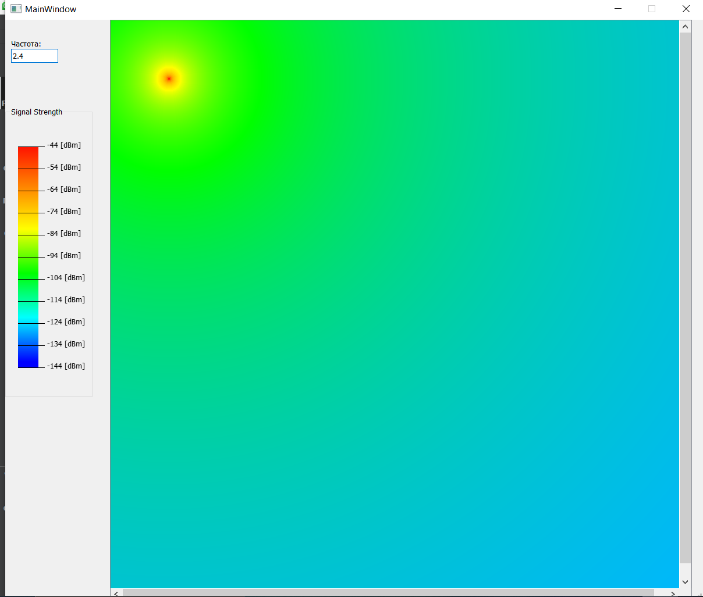
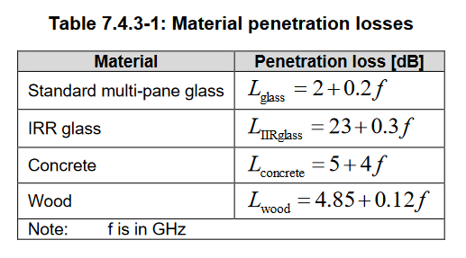
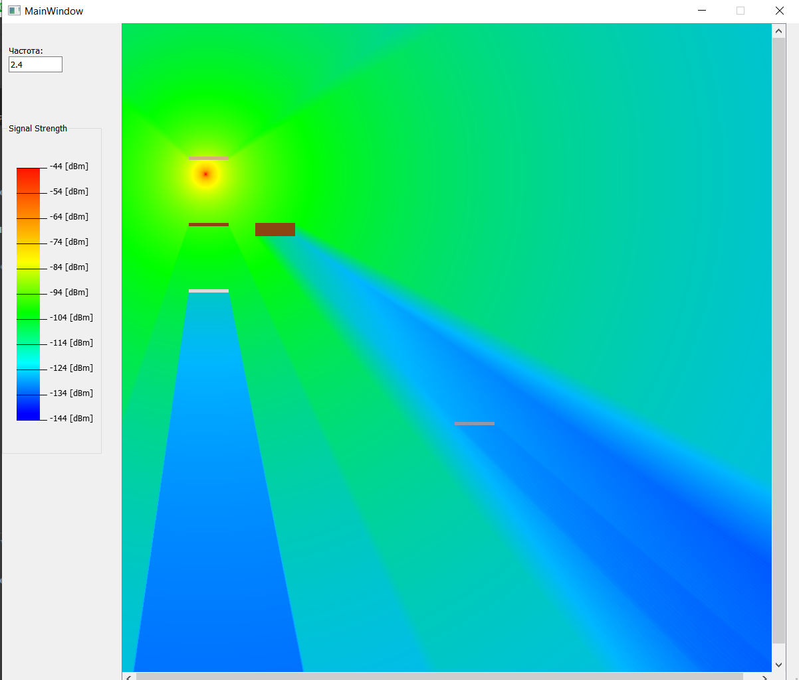

# Signal-modeling

## Лабораторная работа №1. Тепловая карта
### Формула
    PL1 = 28.0 + 22log10(d) + 20log10(f)
    d - расстояние
    f - частота
### Пример распространения сигнала

## Лабораторная работа №2. Препятствия
    Формулы расчета сигнала при прохождения через препятствия

### Пример распространения сигнала при прохождение через объект
