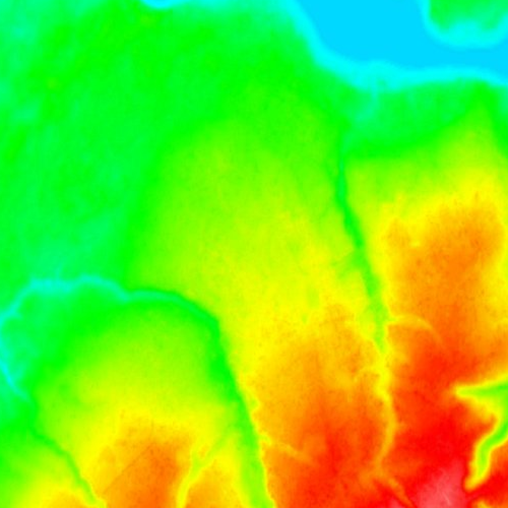

## Преобразование тепловой карты в карту высот

    Для запуска требуется тепловая карта
        heat_map.png

   
    
Пример

    Запуск
    
        parser.cmd

   
    
 Результат: map_heights.png 

    

    Очистить 
    
        parser.cmd clean

